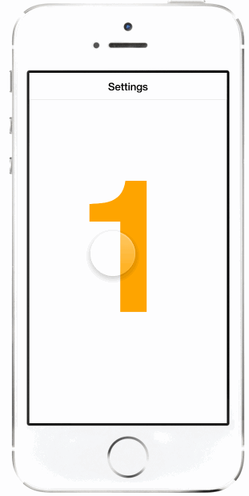
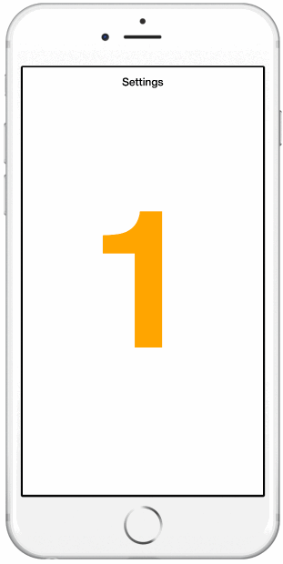

# Navigation Component

A navigation component for Framer. It features:

- Default transitions animations for pushing and popping views, based on iOS UINavigationController, that you can replace with your own ones.
- Default header style and animations to show the current and previous layer, also easily customizable.
- Default header style adapts to iPhone6+ screen size
- Custom events are emitted before and after popping and pushing

## Examples

#### [Simple](http://share.framerjs.com/atdu7phom7cz/)
#### [Complex](http://share.framerjs.com/5bb4btk491ux/)

#### [Custom header](http://share.framerjs.com/r6k5788vlyds/)

#### [Custom transition animation](http://share.framerjs.com/c7e89e4wnvu0/)


## Get started

- Copy the `navigationComponent.coffee` file into your `modules` folder
- Add `NavigationComponent = (require "navigationComponent").NavigationComponent`
- Create the NavigationComponent: `navigationComponent = new NavigationComponent
	rootLayer: yourFirstLayer`

## Simple example

```coffee
	
NavigationComponent = (require "navigationComponent").NavigationComponent

createFullScreenLayer = (text, title) ->
	newLayer = new Layer
		width: Screen.width
		height: Screen.height
		html: text
		backgroundColor: Framer.Utils.randomColor()
	newLayer.title = title
	newLayer.style =
		"font-size" : "600px"
		"color" : "white"
		"line-height" : Screen.height + "px"
		"font-weight" : "bold"
		"text-align" : "center"
	return newLayer
	
firstLayer = createFullScreenLayer("1", "Settings")
firstLayer.name = "First screen"
firstLayer.backgroundColor = "white"
firstLayer.style["color"] = "orange"

navigationComponent = new NavigationComponent
	rootLayer: firstLayer

firstLayer.on Events.Click, ->
	secondLayer = createFullScreenLayer("2", "Long title screen")
	secondLayer.name = "Second screen"
	navigationComponent.push(secondLayer)

```

## Constructor params

- `firstLayer` *(required)* — The layer to initialize the navigation component with.
- `animationPush` — A function that is called when the push animation is needed. It expects two parameters: `fromLayer` -the layer that is on-screen and is going to be pushed- and `toLayer` -the layer that will be shown-. Use these parameters to implement custom animations.
- `animationPop` — You guessed it :) Same as `animationPush` but when popping.
- `animationTime` — A custom transition time. *This parameter is required when implementing custom animations*.

## Properties

- `navigationLayers` — The array of layers that are handled by the navigation component.
- `headerLayer` — The layer that is shown on top of the navigation layer. By default, this layer shows always a custom property `title` string that can be added to each layer on the navigation stack. This layer, when using the default style, has 3 properties: `titleLayer`, `leftLayer` and `backArrow`.
- `currentLayerIndex` — The index of the layer that is being shown.

## Functions

- `push()` — Push a new layer into the navigation component.
- `pop()` — Pop the latest added layer from the navigation component. NOTE: The layer popped is destroyed after being removed from the navigation component, so you might want to create a copy if you want to reuse it later.
- `popToRootLayer()` — Pops to the root layer.
- `popToLayerAtIndex(index)` — Pops layers until the specified index is at the top of the navigation stack

## Events

- `Events.NavigationWillPush` — Called before a new layer is pushed into the navigation stack. It includes an object that has the following properties: `navigationLayer`, `currentLayer` and `nextLayer`.
- `Events.NavigationDidPush` — Called after a new layer has been pushed into the navigation stack. It includes an object that has the following properties: `navigationLayer`, `currentLayer` and `nextLayer`.
- `Events.NavigationWillPop` — Called before a layer (or layers) are popped from the navigation stack. It includes an object that has the following properties: `navigationLayer`, `currentLayer`, `nextLayer` and `index`.
- `Events.NavigationDidPop` — Called after a layer (or layers) are popped from the navigation stack. It includes an object that has the following properties: `navigationLayer`, `currentLayer`, `nextLayer` and `index`.

### References

Thanks to the following creators for sharing their work:

- [framer-viewNavigationComponent](https://github.com/chriscamargo/framer-viewNavigationComponent) by Chris Camargo
- [Cloning the UI of iOS 7 with HTML, CSS and JavaScript](http://come.ninja/2013/cloning-the-ui-of-ios-7-with-html-css-and-javascript/) by Côme Courteault

Other references: 

- [iOS 8 Design Cheat Sheet for iPhone 6 and iPhone 6 Plus](http://click-labs.com/ios-8-design-cheat-sheet-and-free-iphone6plus-gui-psd/)

## TODO

- Add slide right to pop
- Replace header layers animations for state transitions
- Add right button action